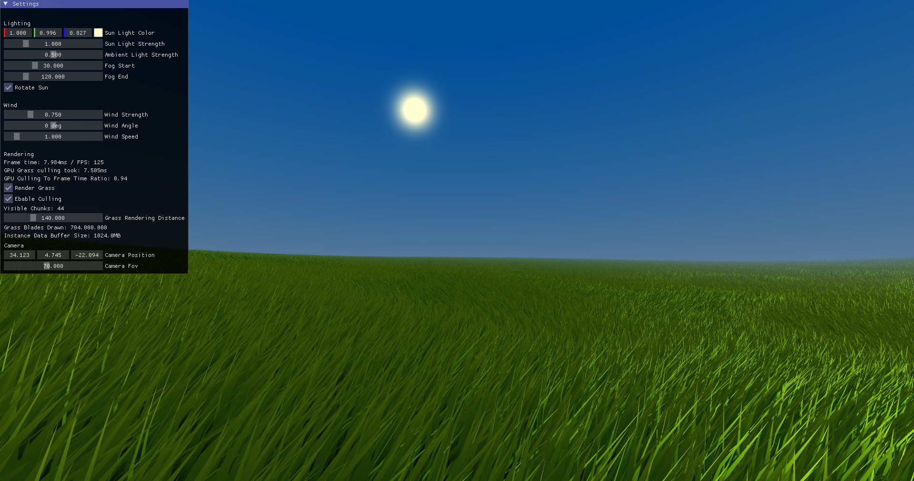

Grass renderer written in C++ using OpenGL as a graphics API.  
This project helped me learn Intermediate level OpenGL code, Compute shaders, GPU Culling and Infirect Drawing.  

Dependencies are:  
Dear ImGui - Immediate mode gui for debug info  
GLM - Math  
stb_image - Image loading  
glfw - Windowing and input  
glad - Easy access to OpenGL functions  
TinyObjLoader - for loading simple .obj meshes  
